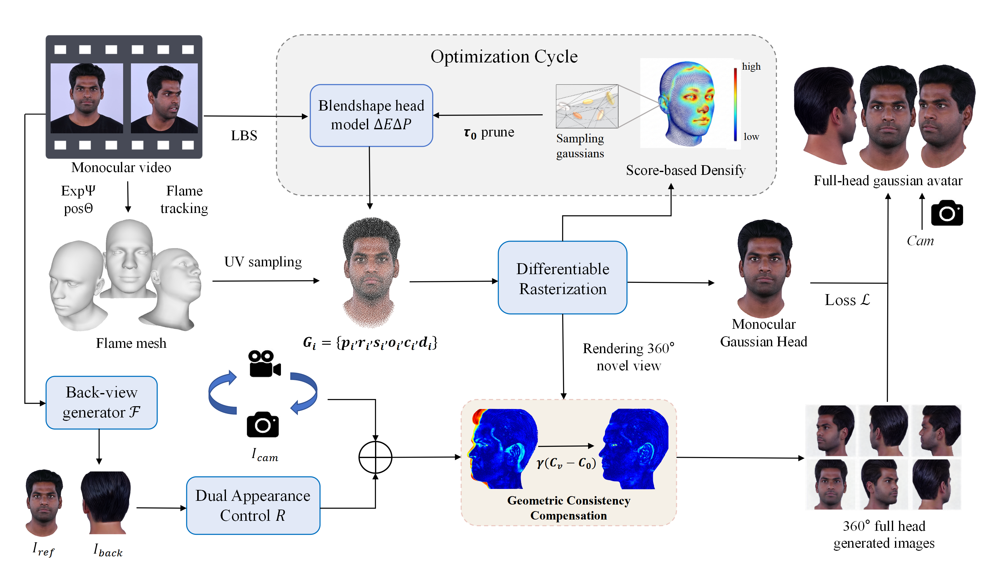

# FidAvatar: High-Fidelity 360◦ Gaussian Head Avatars from Monocular Video via PortraitDiffusion Priors



This repository intentionally omits large external model files and the vendored PyTorch3D source tree. After cloning the code, restore the following paths before running training, completion, or evaluation.

## Omitted Files

| Local path | Approx. size | Source |
| --- | ---: | --- |
| `diffportrait360/code/openai/clip-vit-large-patch14/` | 3.2 GB | [openai/clip-vit-large-patch14](https://huggingface.co/openai/clip-vit-large-patch14/tree/main) |
| `evaluation/models/antelopev2/` | 657 MB | [DIAMONIK7777/antelopev2](https://huggingface.co/DIAMONIK7777/antelopev2/tree/main), [FoivosPar/Arc2Face](https://huggingface.co/FoivosPar/Arc2Face/tree/main) |
| `weights/` | 5+ GB | [gym890/diffportrait360](https://huggingface.co/gym890/diffportrait360/tree/main), [zjwfufu/FateAvatar](https://github.com/zjwfufu/FateAvatar) |
| `pytorch3d/` | Dependency | [facebookresearch/pytorch3d](https://github.com/facebookresearch/pytorch3d) |
| `submodules/3DDFA_V2/` | Submodule | [cleardusk/3DDFA_V2](https://github.com/cleardusk/3DDFA_V2.git) |
| `submodules/GFPGAN/` | Submodule | [TencentARC/GFPGAN](https://github.com/TencentARC/GFPGAN.git) |
| `submodules/MODNet/` | Submodule | [ZHKKKe/MODNet](https://github.com/ZHKKKe/MODNet.git) |
| `submodules/face-parsing.PyTorch/` | Submodule | [zllrunning/face-parsing.PyTorch](https://github.com/zllrunning/face-parsing.PyTorch.git) |
| `submodules/nvdiffrast/` | Submodule | [NVlabs/nvdiffrast](https://github.com/NVlabs/nvdiffrast.git) |

## Setup

Clone the repository with submodules:

```bash
git clone --recursive https://github.com/YiruiYuan/FidAvatar.git
```

Create and activate the conda environment:

```bash
conda env create -f environment.yaml
conda activate fidavatar
```

Install the source-built packages after the environment is active:

```bash
pip install ./submodules/diff-gaussian-rasterization
pip install ./submodules/simple-knn
pip install ./submodules/nvdiffrast
git clone https://github.com/facebookresearch/pytorch3d.git
cd pytorch3d
pip install .
cd ..
```

The pinned environment follows the provided `conda list` output. It intentionally leaves `diff-gaussian-rasterization`, `simple-knn`, `nvdiffrast`, and `pytorch3d` to the source-install commands above.

The environment includes the Hugging Face CLI as `huggingface-cli`. Newer versions may also provide the shorter `hf` command.

## Download Models

### CLIP

Download `openai/clip-vit-large-patch14` into:

```text
diffportrait360/code/openai/clip-vit-large-patch14/
```

Command-line option:

```bash
mkdir -p diffportrait360/code/openai
huggingface-cli download openai/clip-vit-large-patch14 \
  --local-dir diffportrait360/code/openai/clip-vit-large-patch14
```

### AntelopeV2 and ArcFace

Put these five ONNX files from `DIAMONIK7777/antelopev2` into `evaluation/models/antelopev2/`:

```text
1k3d68.onnx
2d106det.onnx
genderage.onnx
glintr100.onnx
scrfd_10g_bnkps.onnx
```

Also put `arcface.onnx` from `FoivosPar/Arc2Face` into the same directory.

Command-line option:

```bash
mkdir -p evaluation/models/antelopev2
huggingface-cli download DIAMONIK7777/antelopev2 \
  1k3d68.onnx 2d106det.onnx genderage.onnx glintr100.onnx scrfd_10g_bnkps.onnx \
  --local-dir evaluation/models/antelopev2
huggingface-cli download FoivosPar/Arc2Face arcface.onnx \
  --local-dir evaluation/models/antelopev2
```

### Weights

Create `weights/` in the repository root. DiffPortrait360 checkpoints should be downloaded from `gym890/diffportrait360`, including:

```text
easy-khair-180-gpc0.8-trans10-025000.pkl
back_head-230000.th
model_state-340000.th
```

If available from the same mirror, also place `spherehead-ckpt-025000.pkl` there. The remaining FateAvatar weights are listed in the "Download weights" section of https://github.com/zjwfufu/FateAvatar and should also be copied into `weights/`.

The expected `weights/` files for this codebase are:

```text
79999_iter.pth
FLAME_masks.pkl
GFPGANv1.3.pth
back_head-230000.th
back_of_head.txt
config.json
detection_Resnet50_Final.pth
diffusion_pytorch_model.safetensors
down_billboard_tri.obj
easy-khair-180-gpc0.8-trans10-025000.pkl
generic_model.pkl
head_template_mouth_close.obj
landmark_embedding.npy
modnet_webcam_portrait_matting.ckpt
model_state-340000.th
neck_exclude_vertex.txt
parsing_parsenet.pth
shape_predictor_68_face_landmarks.dat
spherehead-ckpt-025000.pkl
up_billboard_tri.obj
vgg16.pt
```

## Acknowledgement

This repository is built on [3DGS](https://github.com/graphdeco-inria/gaussian-splatting) and incorporates several amazing open source projects: [3DDFA_V2](https://github.com/cleardusk/3DDFA_V2), [GFPGAN](https://github.com/TencentARC/GFPGAN), and Diffportrait360.

We thank [FateAvatar](https://github.com/zjwfufu/FateAvatar), [SplattingAvatar](https://github.com/initialneil/SplattingAvatar), [MonoGaussianAvatar](https://github.com/yufan1012/MonoGaussianAvatar), and [GaussianAvatars](https://github.com/ShenhanQian/GaussianAvatars) for releasing their code, which facilitates our experiments.

Thank all the authors for their great work.

## License

Copyright (c) 2026 FidAvatar authors. All rights reserved unless a separate license file is added.

This repository includes or depends on third-party code, pretrained models, and datasets. Those components are governed by their original licenses and terms of use, including the referenced GitHub repositories and Hugging Face model pages.
